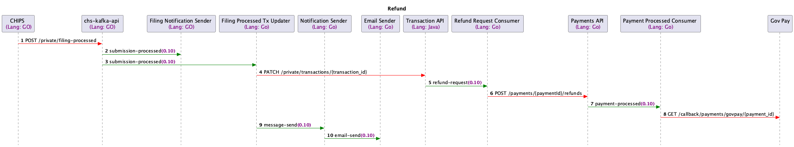

# Refund Request Consumer

## Overview
This service consumes messages from the `refund-request` Kafka topic and initiates the refund process by interacting with the [payment service](https://github.com/companieshouse/payments.api.ch.gov.uk).

The diagram below shows how the refund-request-consumer is used in the refund journey.

## Requirements
In order to run the service locally you will need the following:
- [Java 21](https://www.oracle.com/java/technologies/downloads/#java21)
- [Maven](https://maven.apache.org/download.cgi)
- [Git](https://git-scm.com/downloads)

## Getting started
To checkout and build the service:
1. Clone [Docker CHS Development](https://github.com/companieshouse/docker-chs-development) and follow the steps in the README.
2. Run ./bin/chs-dev services enable refund-request-consumer-java kafka3 zookeeper-kafka3
3. Run ./bin/chs-dev development enable refund-request-consumer-java if you wish to see changes in the code
4. TODO - add how to use the [tool](https://github.com/companieshouse/chs-tools/tree/add_kafka_message_sender)

These instructions are for a local docker environment.

## Configuration

| Variable                      | Description                                                                                     | Example (from docker-chs-development) |
|-------------------------------|-------------------------------------------------------------------------------------------------|---------------------------------------|
| PAYMENT_API                   | The client ID of an API key, with internal app privileges, to call payments-api with            | abc123def456ghi789                    |
| BOOTSTRAP_SERVER_URL          | The URL to the kafka broker                                                                     | kafka:9092                            |
| CONCURRENT_LISTENER_INSTANCES | The number of listeners run in parallel for the consumer                                        | 1                                     |
| REFUND_REQUEST_TOPIC          | The topic ID for refund request topic                                                           | refund-request                        |
| GROUP_ID                      | The group ID for the service's Kafka topics                                                     | refund-request-consumer               |
| MAX_ATTEMPTS                  | The number of times a message will be retried before being moved to the error topic             | 2                                     |
| BACKOFF_DELAY                 | The incremental time delay between message retries                                              | 60 (seconds)                          |
| LOGLEVEL                      | The level of log messages output to the logs                                                    | debug                                 |
| HUMAN_LOG                     | A boolean value to enable more readable log messages                                            | 1                                     |
| PORT                          | The port at which the service is hosted in ECS                                                  | 8080                                  |

# Error Handling

Two main types of exceptions are thrown:
* RetryableException
  * HTTP Responses (excluding 400 & 409)
  * de-serialisation - InvalidPayloadException
* NonRetryableException
  * 400 HTTP Response
  * 409 HTTP Response
  * URI Validation Exception

In the event of an error occurring while processing a message, the message will be placed into the refund-request-retry topic. If it continues to fail the message will be placed into a into the refund-request-error topic to be examined by FESS.

## Design

[design](./docs/design/readme.md)

## Testing

[Testing](./docs/testing/readme.md)
