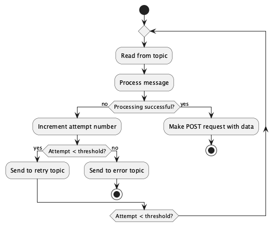

## Design

The Consumer reads from the refund-request-consumer topic and deserialises the data into:
  * Attempt
  * PaymentID
  * RefundAmount
  * RefundReference

Once a message is successfully read from the topic a POST request is made to the payments API `/payments/{paymentId}/refunds`

# Diagrams
## Activity

